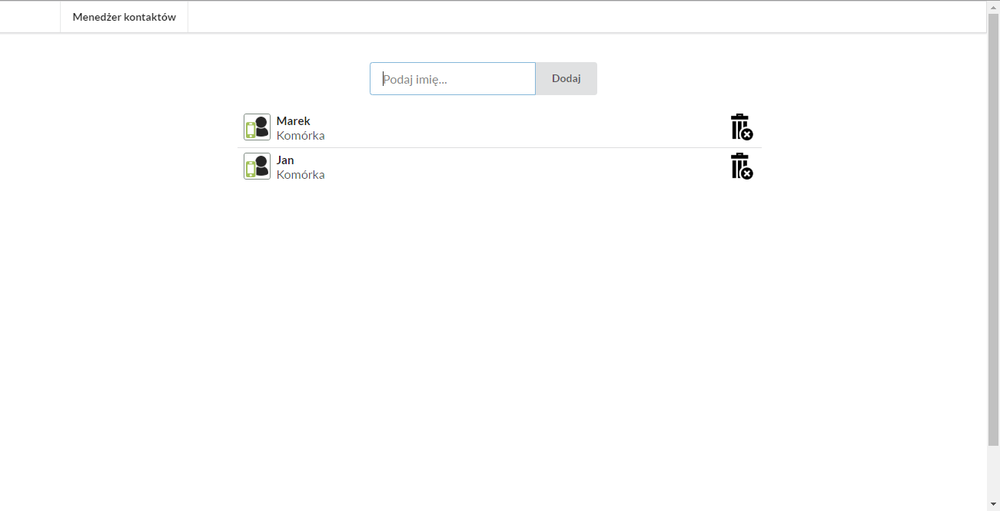

# Contact Manager

## Link
[https://anna-koziol.github.io/contact-manager-react/](https://anna-koziol.github.io/contact-manager-react/)

## What Is This?
Simple contact manager with the possibility of adding, removing and editing items.

## How To Use?
* Website  
Open [https://anna-koziol.github.io/contact-manager-react/](https://anna-koziol.github.io/contact-manager-react/) and start use.   
In placeholder write new name and click button to append element, clicking on the bakset image you can remove and double clicking in name (bolder font) you run the editing option.

* Local  
In the project directory in terminal, you can run:
npm start or yarn start (packages must be installed beforehand).  
Open http://localhost:3000 to view it in the browser and this is it.  
The page will reload if you make edits.

## License
This project is released under the MIT Licence.

## Author
Anna Koziol

## Screen

